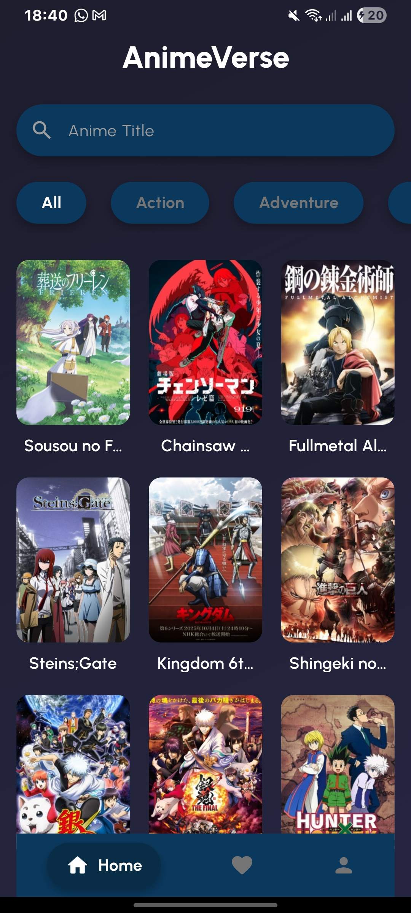
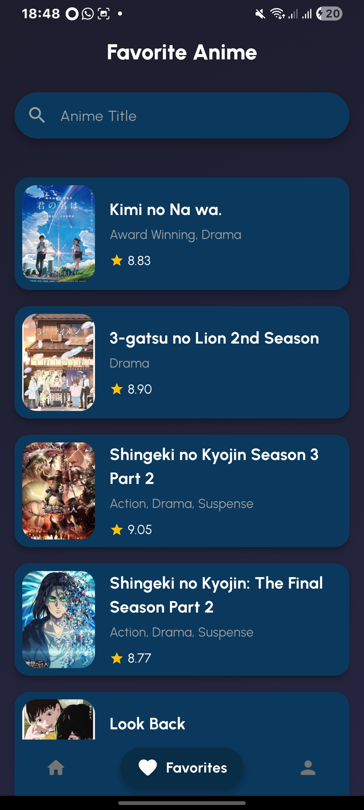
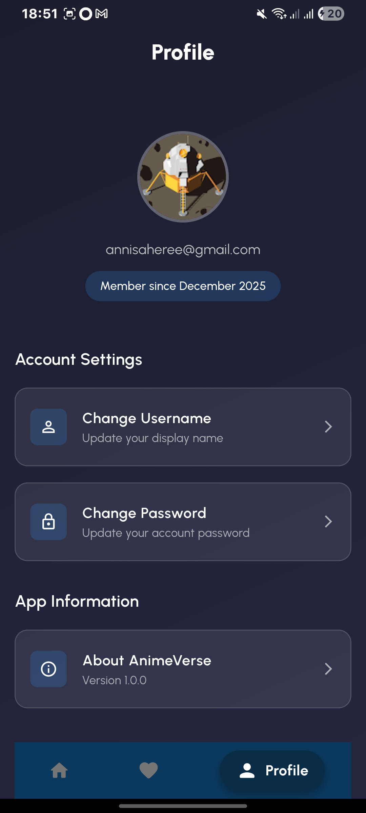
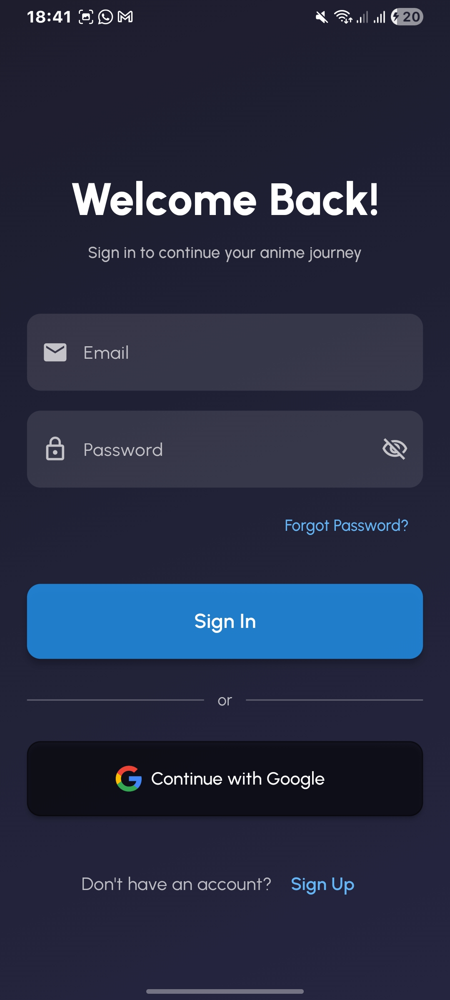
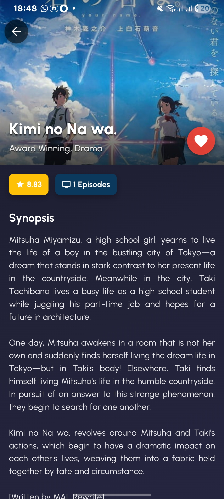

# AnimeVerse

AnimeVerse is a Flutter app for discovering, searching, and managing your favorite anime. It features a modern UI, Material 3 design, and integrates with Firebase for authentication and Firestore for data.

## Features

- **Anime List & Details:** Browse anime with images, genres, ratings, and details.
- **Favorites:** Mark and search your favorite anime, with persistent storage.
- **Authentication:** Sign up/sign in with email/password or Google. Password reset and change supported.
- **Profile:** View and update profile info, including display name and password.
- **Responsive UI:** Adapts to mobile and larger screens.
- **Custom Theming:** Gradient backgrounds, custom fonts (Urbanist), and beautiful cards.
- **Search & Filter:** Search anime and favorites by title.
- **Provider State Management:** Efficient state updates for anime data, favorites, and auth.
- **Assets:** Rich image and font assets for a polished look.


## Screenshots

<table>
	<tr>
		<td></td>
		<td></td>
		<td></td>
	</tr>
	<tr>
		<td></td>
		<td></td>
	</tr>
</table>


## Tech Stack

- **Flutter** (Material 3)
- **Provider** for state management
- **go_router** for navigation
- **Firebase Auth & Firestore**
- **SharedPreferences** for local persistence
- **CachedNetworkImage** for fast image loading

## Project Structure

- `lib/models/anime.dart`: Anime data model
- `lib/provider/app_state_provider.dart`: State management for anime, favorites, search
- `lib/screens/`: Main screens (home, detail, favorites, profile, signin, signup)
- `lib/widgets/`: UI components (anime card, favorite card, scaffold, gradient background)
- `assets/images/`: Anime images and icons
- `assets/fonts/`: Urbanist font family

## Getting Started

1. **Clone the repo**
2. **Install dependencies:**  
	```
	flutter pub get
	```
3. **Configure Firebase:**  
	Add your `google-services.json` (Android) and `GoogleService-Info.plist` (iOS) as needed.
4. **Run the app:**  
	```
	flutter run
	```

## Release Information

- **Current Version:** v1.1.0
- **Release Date:** December 6, 2025
- **Download:** [Latest Release](https://github.com/moozunch/animeVerse/releases)

## Changelog

- v1.0.0
	- Initial public release

## How to Download & Install

1. Go to the [Releases page](https://github.com/moozunch/animeVerse/releases)
2. Download the latest APK or source code
3. For Android: Install the APK on your device
4. For source: Follow the Getting Started instructions above

## License

This project is licensed under the MIT License. See the [LICENSE](LICENSE) file for details.

## Contact / Support

For issues, suggestions, or support, please open an issue on the [GitHub Issues page](https://github.com/moozunch/AnimeFirst/issues).

-----

## School Assignment
- Nama Lengkap : Annisa Putri Aprilia
- Nim : 231401036
- LAB PEMROGRAMAN MOBILE 5
- [VIDEO DEMO](https://drive.google.com/file/d/1wr5mHyYJTUGnU4WOHBOMvywJriYINuLv/view?usp=sharing)
